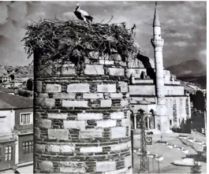
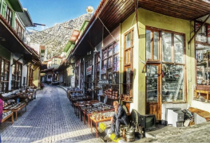
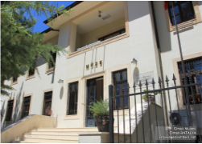
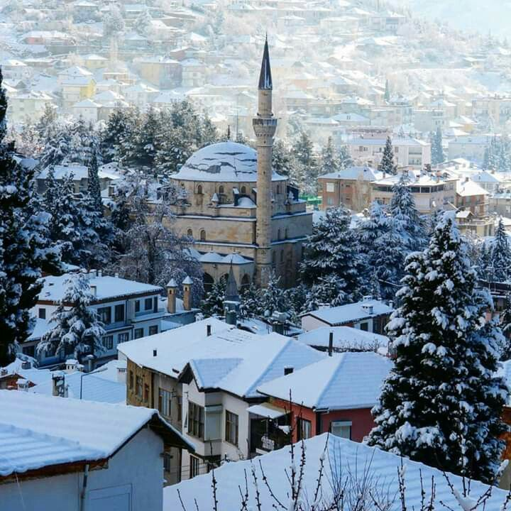
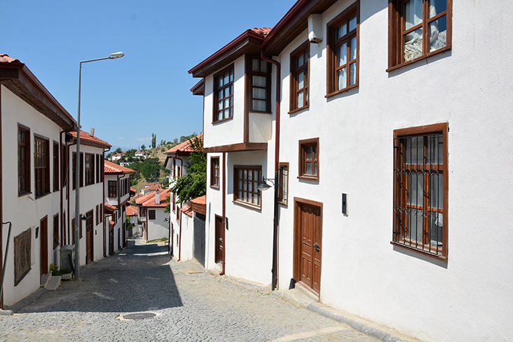
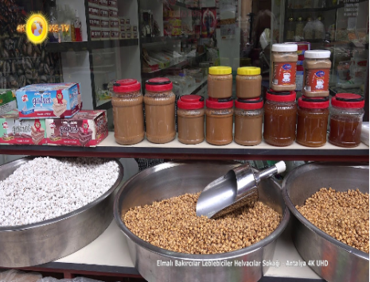

<!doctype html>
<html lang="en">
  <head>
    <!-- Required meta tags -->
    <meta charset="utf-8">
    <meta name="viewport" content="width=device-width, initial-scale=1">

    <!-- Bootstrap CSS -->
    <link rel="preconnect" href="https://fonts.gstatic.com">
<link href="https://fonts.googleapis.com/css2?family=Roboto+Slab:wght@300&display=swap" rel="stylesheet">
    <link rel="stylesheet" href="css/bootstrap.min.css">
    <link rel="stylesheet" href="css/style.css"/>
    <link rel="stylesheet" href="css/icon.css">
    <link rel="stylesheet" href="index.php">
    <link rel="stylesheet" href="login.php">
    <title>Anasayfa</title>
    <link rel="stylesheet" href="css/bootstrap-theme.min.css" />
	
	
    </head>

  </head>

  <body>
    <!--Menü Başlangıç-->

    <nav class="navbar navbar-expand-lg kapsayici fixed-top">
      

        <a class="navbar-brand baslik" href="#">Antalya/Elmalı</a>
        <button 
        class="navbar-toggler icon_border" 
        type="button"
        data-bs-toggle="collapse" 
        data-bs-target="#navbarSupportedContent" 
        aria-controls="navbarSupportedContent" 
        aria-expanded="false" 
        aria-label="Toggle navigation">
          
        </button>
        

          <ul class="navbar-nav mx-auto mb-2 mb-lg-0">
            <li class="nav-item me-5">
              <a class="nav-link active" aria-current="page" href="#hakkinda">Hakkında</a>
            </li>
            <li class="nav-item me-5">
              <a class="nav-link" href="#cv">CV</a>
            </li>
            <li class="nav-item me-5">
              <a class="nav-link" href="#sehrim">Şehrim</a>
            </li>
            <li class="nav-item me-5">
              <a class="nav-link" href="#miras">Mirasımız</a>
            </li>
            <li class="nav-item me-5">
              <a class="nav-link" href="#ilgialanlarim">İlgi Alanlarım</a>
            </li>
            <li class="nav-item me-5">
              <a class="nav-link" href="#iletisim">İletişim</a>
            </li>
            <li class="nav-item me-5">
              <a class="nav-link" href="#login">Login</a>
            </li>
            
          </ul>
        

      

    </nav>

    <!--Menü Bitiş-->

     <!--Hakkında Başlangıç-->

     <section class="p-5 text center hakkimizda" id="hakkinda">
       <section class="container">
        
        <h1 class="mb-5 font-weight-bold metin">HAKKINDA</h1>
         
       

       
       <h9> İsmim Nurgül Serin. 19 Nisan 2002 tarihinde Antalya'nın Elmalı ilçesinde doğdum. Liseye kadar Elmalı'da okuduktan sonra liseyi Antalya'da okudum. Üniversiteyi Sakarya Üniversitesi Bilgisayar Mühendisliği bölümünü kazandım. 1.sınıftayım.
        Ortaokuldaki bir hocam sayesinde kitap okuma alışkanlığı kazandım. Yine ortaokulda basketbol ve voleybol oynamaya başladım ve voleybolu lisede de devam ettirdim. Ne kadar amatör olarak oynamış olsam da gelişimime katkıda bulunmuştur.
        Piknik yapmayı, gezmeyi, eğlenmeyi çok severim.</h9>   

        

          

            <figure class="figure">
              
            </figure>
          

        

        

          

            <figure class="figure">
              
            </figure>
          

        

        

          

            <figure class="figure">
              
            </figure>
          

        

        
        </section>
      <!--Hakkında Bitiş-->
      

      <!--CV Başlangıç-->
      <h5 class="metincv" id="cv"> CV </h5>

      <article class="all-cv">
      
      <article class="cv">
        <h8>Özgeçmiş</h8>
        
İsmim Nurgül SERİN. 19 Nisan 2002 tarihinde Antalya/Elmalı’da doğdum.

      </article>
        
        <article class="cv">
        <h8>Okuduğu Okullar</h8>
        
İlkokulda Elmalı Muhammed Hamdi Yazır İlköğretim okulunda okudum. Ortaokulu ise Elmalı Sinan-ı Ümmi İmam Hatip Ortaokulu'nda okudum. Liseyi Antalya Hayme Ana Kız Anadolu İmam Hatip Lisesi'nde bitirdim. Daha sonra Sakarya Üniversitesi'ni kazandım. Şuan Sakarya Üniversitesi Bilgisayar ve Bilişim Bilimleri Fakültesi Bilgisayar Mühendisliği bölümünde 1. sınıfta okuyorum. 

        </article>
      </article>
      <!--CV Bitiş-->
     

     <!--Şehrim Başlangıç-->

     <h8 class="sehrim" id="sehrim">ŞEHRİM</h8>  
                      
                                       
                      
                      
  

  <!--Şehrim Bitiş--> 
  

  <!--Mirasımız Başlangıç--> 
  <h9 class="metinm" id="miras">MİRASIMIZ</h9>
    
  <h12 class="omerpasa">ÖMER PAŞA CAMİİ</h12>
    
  
  <!--Mirasımız Bitiş--> 

  <!--İlgi alanlarım Başlangıç--> 
  <h10 class="metinilgi" id="ilgialanlarim">İLGİ ALANLARIM</h10>
    
  

 
  <!--İlgi alanlarım Bitiş--> 

      <!--İletişim Başlangıç-->

      <h1 class="metiniletisim" id="iletisim">İLETİŞİM SAYFASI</h1>
    <form name="form-isim" action="index.php" method="post" >
        <!--ad-soyad-->
        <table cellspacing="8">
            <tr>
            <td>ADI</td><td>:</td>
            <td><input type="text" name="adi"></td>
            </tr>
            <tr>
            <td>SOYADI</td><td>:</td>
            <td><input type="text" name="soyadi"></td>
            </tr>
            <table>
            
        <!--ad-soyad-->
         

        <!--cinsiyet-->
        Cinsiyetiniz: 
        <input type="radio" name="cinsiyet" value="erkek"  checked>Erkek 
        <input type="radio" name="cinsiyet" value="kadin"  checked>Kadın       
        <!--cinsiyet-->
        <h2>

        </h2>
        Hobileriniz: 
        <!--hobi-->
        <input type="checkbox" name="hobi1" value="Basketbol">Basketbol 
        <input type="checkbox" name="hobi2" value="Voleybol">Voleybol 
        <input type="checkbox" name="hobi3" value="Futbol">Futbol 
        <input type="checkbox" name="hobi4" value="Kitap">Kitap Okuma 
        <input type="checkbox" name="hobi5" value="Tenis">Tenis 
        <input type="checkbox" name="hobi6" value="Bisiklet">Bisiklete Binme 
        <!--hobi-->

        <h2>
        </h2>
        Elektronik Posta Adresiniz:  
        <input type="email" name="email" required>

        <h2>
        </h2>
        
        Yaşadığınız Şehri Seçiniz.. 
        <select name="sehir">
            <option value="bos">Seçiniz...</option>
            <option value="1">Adana</option>
            <option value="2">Adıyaman</option>
            <option value="3">Afyonkarahisar</option>
            <option value="4">Ağrı</option>
            <option value="68">Aksaray</option>
            <option value="5">Amasya</option>
            <option value="6">Ankara</option>
            <option value="7">Antalya</option>
            <option value="75">Ardahan</option>
            <option value="8">Artvin</option>
            <option value="9">Aydın</option>
            <option value="10">Balıkesir</option>
            <option value="74">Bartın</option>
            <option value="72">Batman</option>
            <option value="69">Bayburt</option>
            <option value="11">Bilecik</option>
            <option value="12">Bingöl</option>
            <option value="13">Bitlis</option>
            <option value="14">Bolu</option>
            <option value="15">Burdur</option>
            <option value="16">Bursa</option>
            <option value="17">Çanakkale</option>
            <option value="18">Çankırı</option>
            <option value="19">Çorum</option>
            <option value="20">Denizli</option>
            <option value="21">Diyarbakır</option>
            <option value="81">Düzce</option>
            <option value="22">Edirne</option>
            <option value="23">Elazığ</option>
            <option value="24">Erzincan</option>
            <option value="25">Erzurum</option>
            <option value="26">Eskişehir</option>
            <option value="27">Gaziantep</option>
            <option value="28">Giresun</option>
            <option value="29">Gümüşhane</option>
            <option value="30">Hakkâri</option>
            <option value="31">Hatay</option>
            <option value="76">Iğdır</option>
            <option value="32">Isparta</option>
            <option value="34">İstanbul</option>
            <option value="35">İzmir</option>
            <option value="46">Kahramanmaraş</option>
            <option value="78">Karabük</option>
            <option value="70">Karaman</option>
            <option value="36">Kars</option>
            <option value="37">Kastamonu</option>
            <option value="38">Kayseri</option>
            <option value="71">Kırıkkale</option>
            <option value="39">Kırklareli</option>
            <option value="40">Kırşehir</option>
            <option value="79">Kilis</option>
            <option value="41">Kocaeli</option>
            <option value="42">Konya</option>
            <option value="43">Kütahya</option>
            <option value="44">Malatya</option>
            <option value="45">Manisa</option>
            <option value="47">Mardin</option>
            <option value="33">Mersin</option>
            <option value="48">Muğla</option>
            <option value="49">Muş</option>
            <option value="50">Nevşehir</option>
            <option value="51">Niğde</option>
            <option value="52">Ordu</option>
            <option value="80">Osmaniye</option>
            <option value="53">Rize</option>
            <option value="54">Sakarya</option>
            <option value="55">Samsun</option>
            <option value="56">Siirt</option>
            <option value="57">Sinop</option>
            <option value="58">Sivas</option>
            <option value="63">Şanlıurfa</option>
            <option value="73">Şırnak</option>
            <option value="59">Tekirdağ</option>
            <option value="60">Tokat</option>
            <option value="61">Trabzon</option>
            <option value="62">Tunceli</option>
            <option value="64">Uşak</option>
            <option value="65">Van</option>
            <option value="77">Yalova</option>
            <option value="66">Yozgat</option>
            <option value="67">Zonguldak</option>
          </select>
        </select>

        <h2>
        </h2>
        <input type="submit" value="POST İLE GÖNDER">
    </form>

      <!--İletişim Bitiş-->

      <!--Login Başlangıç-->
      <h3 class="metinl" id="login">LOGİN SAYFASI</h3>

      <form action="kontrol.php" method="post">
        Kullanıcı: 
        <input type="text" name="kullanici" /> 
        Şifre: 
        <input type="password" name="sifre" /> 
        <input type="submit" value="Giriş yap" />
        </form>

      <!--Login Bitiş-->

      

    <!-- Optional JavaScript; choose one of the two! -->

    <!-- Option 1: Bootstrap Bundle with Popper -->
    
    <!-- Option 2: Separate Popper and Bootstrap JS -->
    <!--
    
    
    -->
  </body>
</html>

<!--CSS KODLARI BAŞLANGIÇ-->
<!--style.css-->
.kapsayici{
    background-color: #ca8a8b;
}
.nav-link{
    color:#5b6d5b;
    font-family: "Montserrat","sans-serif";
}
.baslik{
    color: #035003;
    font-size: smaller;
}

@media(max-width:768px){

    .nav-item{
        margin-top: 15px;
        transition: all  0.5s ease;
    }
    .nav-item:hover{
        background-color:#faf1e6;
        padding-left: 40px;
    }
    .nav-link:hover{
        color: #5b6d5b;
    }
    .icon_border{
        color: maroon;
    }
}
.hakkimizda{
    background-color: #faf1e6;
}

.metin{
    font-family: 'Roboto Slab', serif;
    background-color: mediumaquamarine;
}
.metinl{
    font-family: 'Roboto Slab', serif ;
    background-color: rgb(126, 82, 2);
}
.metiniletisim{
    font-family: 'Roboto Slab', serif;
    background-color: rgb(167, 38, 15);
}
.metincv{
    font-family: 'Roboto Slab', serif ;
    background-color: rgb(104, 169, 223);
}
.metinm{
    font-family: 'Roboto Slab', serif ;
    background-color: #0d960d;
}
.metinilgi{
    font-family: 'Roboto Slab', serif;
    background-color: rgb(64, 111, 180);
}

.all-cv {
    margin: 0;
    padding: 5px;
    background-color: lightgray;
  }
  
  .all-cv > h5, .cv {
    margin: 10px;
    padding: 5px;
  }
  
  .cv {
    background: white;
  }
  
  .cv > h8, p {
    margin: 4px;
    font-size: 90%;
  }

.sehrim{
    font-family: 'Roboto Slab', serif ;
    background-color: magenta;
}

.evler{
    background-color: #faf1e6;
}
.evlermetin{
    font-family: 'Roboto Slab', serif ;
    background-color: #ca8a8b;
}
.gecmis{
    font-family:'Franklin Gothic Medium', 'Arial Narrow', Arial, sans-serif;
    background-size: 40%;
}
.p{
    background-size: 30%;
}

.tarihi {
    margin: 0;
    padding: 5px;
    background-color: lightgray;
  }
  
  .tarihi > h1, .tarihiev {
    margin: 10px;
    padding: 5px;
  }
  
  .tarihiev {
    background: white;
  }
  
  .tarihiev > h8, p {
    margin: 4px;
    font-size: 90%;
  }

<!--CSS KODLARI BİTİŞ-->

<!--evler.html-->
<!DOCTYPE html>
<html lang="en">
<head>
    <meta charset="UTF-8">
    <meta http-equiv="X-UA-Compatible" content="IE=edge">
    <meta name="viewport" content="width=device-width, initial-scale=1.0">
    <link rel="stylesheet" href="css/style.css">
    <title>Tarihi Evler</title>
</head>
<body>
    <section class="p-5 text center evler">
        

         
         <h1 class="mb-5 font-weight-bold evlermetin">TARİHİ ELMALI EVLERİ</h1>
    

    <article class="tarihi">
      
        <article class="tarihiev">
          <h8 class="gecmis">Tanıtımı</h8>
          
Eski çarşıları, arastaları ve dar sokaklarıyla, her adımda tarihin derinliklerine uzanarak Anadolu kültürünü yansıtan Elmalı, Elmalı Dağı yakınlarında kurulan oldukça eski bir yerleşim yeridir. Geçmişinin cazibesini bugünlere taşıyan yöre; iklimi, doğla güzellikleri ve Sedir Ormanları ile büyük bir turizm potansiyeli taşımaktadır.Cumbaları, eski tip penceleri ve parlak renkleriyle ilçeyi süsyelen evler ise, zamanın çok gerilerinden bugünü anlatırcasına hala dimdik ayaktadır. Sadece yaşama değil, seyirlik zamanlara da ilham kaynağı olan çift cumbalı ahşap Elmalı Evleri, en az Safranbolu Evleri kadar otantik bir yapıya sahiptir. ve karakteristik özelliklerinin çoğunu bugüne kadar korumayı başarmıştır.
              
            En az 500 yıllık bu evlerin mimari bir öğesi olan ahşap dokusunda, yörenin zenginliği olan sedir ağaçlarından bol miktarda kullanılmıştır. Süslemelerdeki stilize ağaçları, çiçek motifleri ve altı köşeli yıldızlarıyla da Anadolu Kültürünü yansıtan eşsiz örneklerdendir.
              
            Elmalı Evleri içerisinde ele alınabilecek en güzel örnek Yeşil Kapıdır. 1600 yılında yapılmış olan bu yapının ahşap işçiliği, insanı şaşırtacak kadar özel bir ustalığın eseridir.
            Etrafı ormanlarla çevrili Elmalı'da ahşabın mimari bir malzeme olarak kullanıldığı yapılar içinde en görkemlileri Elmalı'nın Tahtamescit Mahallesi'nde Aylar Sokağı'ndaki Elmalı Evleri'dir ki bu sokkata adım adım tarihin izine tanıklık etmek mümkündür. Öte yandan Elmalı tarihi evlerinin restorasyon çalışmaları da sürdürülmektedir.

        </article>
                    
         </article>
        </article>

        

    

        

            <ol class="carousel-indicators">
                <li data-target="#carousel-example-generic"  class="active"></li>
                <li data-target="#carousel-example-generic"  class=""></li>
                <li data-target="#carousel-example-generic"  class=""></li>
            </ol>
            <d class="carousel-inner" role="listbox">
                

                                              
                

                

            

            <a href="#carousel-example-generic" class="left carousel-control" role="button" data-slide="prev">   </a> <a href="#carousel-example-generic"
                                                                class="right carousel-control" role="button"
                                                                data-slide="next">   </a>

                    

            </section>
</body>
</html>

<!--helvacilik.css
<!DOCTYPE html>
<html lang="en">
<head>
    <meta charset="UTF-8">
    <meta http-equiv="X-UA-Compatible" content="IE=edge">
    <meta name="viewport" content="width=device-width, initial-scale=1.0">
    <link rel="stylesheet" href="css/style.css">
    <title>Tarihi Helvacılık Çarşısı</title>
</head>
<body>
    <section class="p-5 text center evler">
        

         
         <h1 class="mb-5 font-weight-bold evlermetin">TARİHİ HELVACILIK ÇARŞISI</h1>
    

    <article class="tarihi">
      
        <article class="tarihiev">
          <h8 class="gecmis">Tanıtımı</h8>
          
Elmalı'nın meşhur leblebisi, şeker leblebisi, çörek helvası, ramazan helvaları, şekerlemeleri burada üretilir ve satılır.
               
            Osmanlı Devleti zamanında sancak geçmişi vardır. Gelindiği zaman mutlaka görülmesi gereken nadide yerlerden birisidir.

 
        </article>
                    
         </article>
        </article>

        

    

        

            <ol class="carousel-indicators">
                <li data-target="#carousel-example-generic"  class="active"></li>
                <li data-target="#carousel-example-generic"  class=""></li>
                <li data-target="#carousel-example-generic"  class=""></li>
            </ol>
            <d class="carousel-inner" role="listbox">
                

                                              
                

                

            

            <a href="#carousel-example-generic" class="left carousel-control" role="button" data-slide="prev">   </a> <a href="#carousel-example-generic"
                                                                class="right carousel-control" role="button"
                                                                data-slide="next">   </a>

                    

            </section>
</body>
</html>

<!--muze.html-->
<!DOCTYPE html>
<html lang="en">
<head>
    <meta charset="UTF-8">
    <meta http-equiv="X-UA-Compatible" content="IE=edge">
    <meta name="viewport" content="width=device-width, initial-scale=1.0">
    <link rel="stylesheet" href="css/style.css">
    <title>Elmalı Müzesi</title>
</head>
<body>
    <section class="p-5 text center evler">
        

         
         <h1 class="mb-5 font-weight-bold evlermetin">ELMALI MÜZESİ</h1>
    

    <article class="tarihi">
      
        <article class="tarihiev">
          <h8 class="gecmis">Tanıtımı</h8>
          
Antalya'nın 111 km. güneybatısında yer alan Elmalı ve çevresi kendine has stratejik ve coğrafi konumu ile Neolitik dönemden günümüze dek, kesintisiz olarak pek çok uygarlığın gelişmesine sahne olmuştur. Bölgede yapılan arkeolojik araştırmalar ve kazılar sonucu ortaya çıkarılmış olan yerleşim yerleri, mezarlar, mimari bulgular ve buluntular bölgede oldukça yüksek ve farklı kültürlerin varlığına işaret etmektedir. Türkiye’nin arkeolojik ve tarihi müzeleri arasında önemli bir yere sahip olan Antalya Elmalı Müzesi'nde bölgenin tarihini aydınlatan çok önemli arkeolojik eserler sergilenmektedir.
             

            Antalya Elmalı Müzesi, Gündoğan Mahallesi, İbrahim Elmalılı caddesi üzerinde bulunan Eski Hükümet Konağı'nda kurulmuştur. Yapıldığı 1941 yılından 1987 yılına kadar ilçenin Hükümet Konağı, daha sonra Vergi Dairesi ve bir bölümü Öğretmen Evi görevini yapmış olan bu yapının içerisinde müze ihtiyaçlarına uygun biçimde değişiklik yapılarak, üçü zemin, sekizi birinci katta olmak üzere on bir adet teşhir salonu oluşturulmuştur. Teşhir tanzim çalışmaları Antalya Müzesi Müdürlüğü'ne bağlı olarak 2011 yılı başında tamamlanan müze, 2011/1655 sayılı Bakanlar Kurulu Kararı ile Bakanlığımız taşra teşkilatına bağlı olarak 13.06.2011 tarihinden itibaren ziyarete açılmıştır. Müze açık hava galerisi olan bir bahçeye de sahiptir.

               
            

 
        </article>
                    
         </article>
        </article>

        

    

        

            <ol class="carousel-indicators">
                <li data-target="#carousel-example-generic"  class="active"></li>
                <li data-target="#carousel-example-generic"  class=""></li>
                <li data-target="#carousel-example-generic"  class=""></li>
            </ol>
            <d class="carousel-inner" role="listbox">
                

                                              
                

                

                

                

               

                

                

            

            <a href="#carousel-example-generic" class="left carousel-control" role="button" data-slide="prev">   </a> <a href="#carousel-example-generic"
                                                                class="right carousel-control" role="button"
                                                                data-slide="next">   </a>

                    

            </section>
</body>
</html>

<!--kesikminare.html-->
<!DOCTYPE html>
<html lang="en">
<head>
    <meta charset="UTF-8">
    <meta http-equiv="X-UA-Compatible" content="IE=edge">
    <meta name="viewport" content="width=device-width, initial-scale=1.0">
    <link rel="stylesheet" href="css/style.css">
    <title>Kesik Minare</title>
</head>
<body>
    <section class="p-5 text center evler">
        

         
         <h1 class="mb-5 font-weight-bold evlermetin">KESİK MİNARE</h1>
    

    <article class="tarihi">
      
        <article class="tarihiev">
          <h8 class="gecmis">Tanıtımı</h8>
          
Antalya'nın Elmalı ilçesinde, 14'üncü veya 15'inci yüzyıldan kaldığı düşünülen ahşap Eski Cami, 78 yıl önce çıkan yangında kül olurken, minaresi asırlardır duruyor. Yangın sorası yaklaşık 13 metre yüksekliğindeki minarede 1990'lı yıllarda restorasyon yapıldı. 2006 yılında da minare Elmalı Belediyesi'nce korumaya alındı.

              
            'Kesik Minare' olarak bilinen, taştan yapılma minare, ilçenin simgesi haline geldi. Elmalı Belediyesi Kültür ve Sosyal İşler Müdürü ve arkeolog Durmuş Altan, minarenin güneyinde, kaide üzerinde bir de güneş saati bulunduğunu anlattı. Altan, "En eski camimiz günümüze kalan minaresiyle olanca güzelliğiyle ihtişamını hala sergilemektedir" dedi. 
              
        </article>
                    
         </article>
        </article>

        

    

        

            <ol class="carousel-indicators">
                <li data-target="#carousel-example-generic"  class="active"></li>
                <li data-target="#carousel-example-generic"  class=""></li>
                <li data-target="#carousel-example-generic"  class=""></li>
            </ol>
            <d class="carousel-inner" role="listbox">
                

                

            <a href="#carousel-example-generic" class="left carousel-control" role="button" data-slide="prev">   </a> <a href="#carousel-example-generic"
                                                                class="right carousel-control" role="button"
                                                                data-slide="next">   </a>

                    

            </section>
</body>
</html>
<!--kesikminare.html-->

<!--index.php-->
<?php
 
echo "Ad:  "+$_POST['adi'];
?>

<?php
 
echo "Soyad:  "+$_POST['soyadi'];
?>

<?php
 
echo "Cinsiyet:  "+$_POST['cinsiyet'];
?>

<?php
 
echo "E-mail adresiniz:  "+$_POST['email'];
?>

<?php
 
echo "Yaşadığı şehir:  "+$_POST['sehir'];
?>
<!--index.php-->

<!--kontrol.php-->
<?php
if(isset($_POST['kullanici']) && isset($_POST['sifre'])) { // form gönderilmiş mi
   $kullanici = $_POST['kullanici'];
   $sifre = $_POST['sifre'];
 
   if(empty($kullanici) || empty($sifre)) { // gönderilenler boş mu
      echo 'Lütfen boş bırakmayın';
   } else {
      if($kullanici == 'b201210090@sakarya.edu.tr' && $sifre == 'b201210090') { // bilgiler doğru mu
         session_start();
         $_SESSION['kullanici'] = 'b201210090@sakarya.edu.tr';
         $_SESSION['sifre'] = 'b201210090';
         echo "Giriş Başarılı. Panel'e yönlendiriliyorsunuz";
         header('refresh: 5; url=panel.php'); 
      } else {
         echo 'Yanlış kullanıcı adı ya da şifre';
      }
   }
} else {
   echo 'Lütfen formu kullanın';
}

?>
<!--kontrol.php-->

<!--panel.php-->
<?php
session_start(); // session kullanımı başlattık
if(isset($_SESSION['kullanici']) && isset($_SESSION['sifre'])) { // bu sefer sessionlar tanımlanmış mı diye bakıyoruz
   if($_SESSION['kullanici'] == 'b201210090@sakarya.edu.tr' && $_SESSION['sifre'] == 'b201210090') {
      echo 'Panele hoşgeldiniz! Bu yazıyı sadece giriş yapmış kişiler görebilir.';
   } else {
      session_destroy(); // bilgileri yanlış olduğu için sessionlar silinir
      echo 'Bilgileriniz yanlış, buraya yanlızca giriş yapmış kişiler girebilir';
   }
} else {
   echo 'Sadece giriş yapmış kişiler görebilir';
}
?>
<!--panel.php-->
